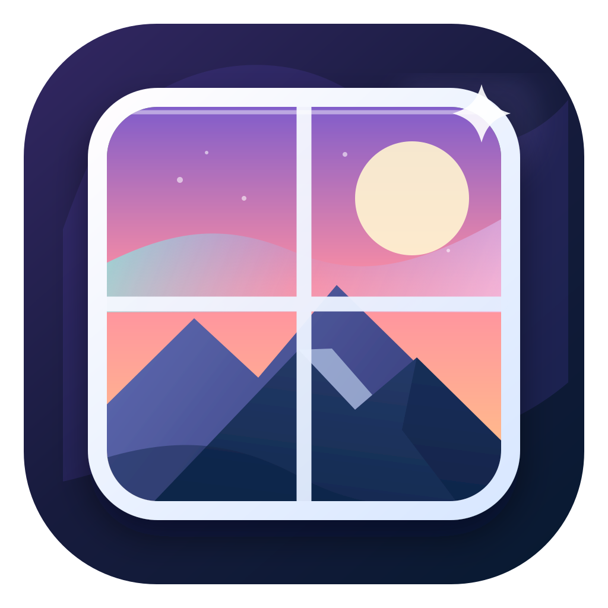
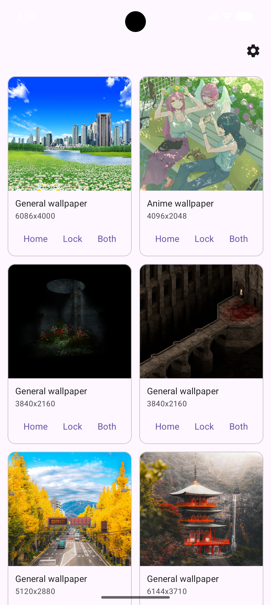
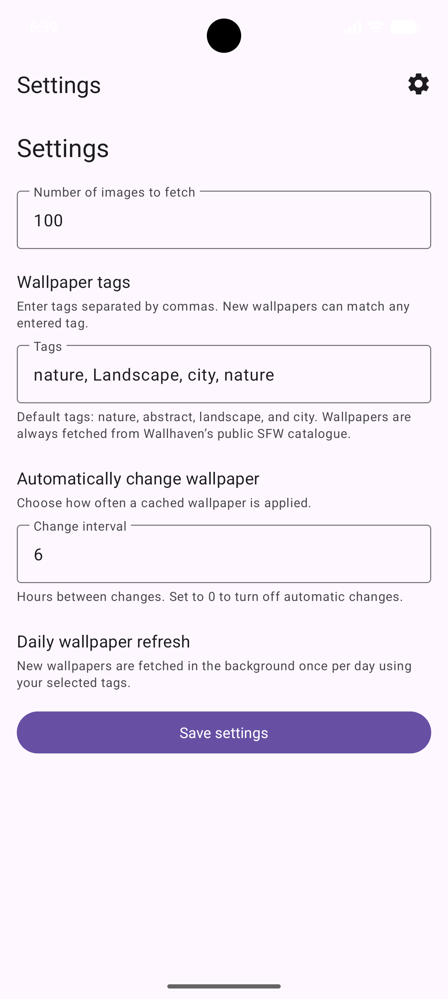

# w4ll.it — Wallhaven Wallpapers for Android

<p align="center">
  
</p>

`w4ll.it` is a free and open-source Android wallpaper app powered by the public [Wallhaven](https://wallhaven.cc/) catalogue. It fetches recent, SFW wallpapers that match your chosen tags, displays them in a two-column grid, and lets you apply a wallpaper to the home screen, lock screen, or both.

<p align="center">
  
  
</p>

## Features

- Fetches the most recently added wallpapers from Wallhaven.
- Uses only Wallhaven's public **SFW** results; no account, API key, or credential is required.
- Displays cached wallpapers in a two-column grid for quick browsing.
- Applies a selected image to the home screen, lock screen, or both.
- Starts fetching automatically when the app opens with an empty wallpaper cache.
- Lets you configure:
  - the number of wallpapers to fetch (1–100; default: 50);
  - comma-separated wallpaper tags (default: `nature, abstract, landscape, city`);
  - a periodic home-screen wallpaper change interval (default: every 6 hours; `0` disables it).
- Refreshes the cached Wallhaven results asynchronously once every 24 hours when a network connection is available.

## Privacy and network services

- The app contains **no advertising, analytics, trackers, accounts, or API keys**.
- Settings and the cached wallpaper list are stored locally on the device.
- To perform its core function, the app contacts Wallhaven and the image hosts returned by Wallhaven. Those services receive normal network-request data, including the device IP address and the requested tags or images.
- Wallhaven is a third-party, non-libre network service. An F-Droid listing must therefore disclose the `NonFreeNet` anti-feature. The app does not contain a proprietary SDK or depend on Google Play services.

## License

w4ll.it source code and the project-owned artwork are released under the [MIT License](LICENSE). Wallpapers fetched from Wallhaven are not part of this source distribution and remain subject to their creators’ rights and Wallhaven’s terms.

## Requirements

- A current stable release of **Android Studio**.
- Android Studio's bundled **JDK 17** (Embedded JDK), or another JDK 17 installation.
- Android SDK Platform 35 (Android 15).
- A physical device or emulator running Android 7.0 / API 24 or later.
- Internet access on the device or emulator to contact Wallhaven and download wallpaper images.

> The project uses Android Gradle Plugin 9.3.2, Kotlin 2.2.10, `compileSdk` 35, `targetSdk` 35, and `minSdk` 24.

## Run from Android Studio

1. Install [Android Studio](https://developer.android.com/studio).
2. Open this repository's root directory—the folder containing `settings.gradle.kts` and `app`.
3. Let Android Studio complete Gradle sync.
   - Install any requested SDK components, including Android SDK Platform 35.
   - If asked for a Gradle JDK, choose **Embedded JDK**.
4. Connect a USB-debugging-enabled device, or create and start an Android Virtual Device with API 24 or newer.
5. Select the device in the Android Studio device selector and press **Run** (`▶`).

## Build a debug APK from the command line

The repository includes the Gradle wrapper. On Windows, use Android Studio's bundled Java runtime:

```bat
set "JAVA_HOME=C:\Program Files\Android\Android Studio\jbr"
set "PATH=%JAVA_HOME%\bin;%PATH%"
call gradlew.bat assembleDebug --stacktrace
```

The generated debug APK is located at:

```text
app\build\outputs\apk\debug\app-debug.apk
```

### Install on a connected device

Ensure `adb devices` shows your device or emulator, then run:

```bat
adb install -r app\build\outputs\apk\debug\app-debug.apk
adb shell am start -n it.w4ll/.MainActivity
```

Alternatively, build and install in one step:

```bat
set "JAVA_HOME=C:\Program Files\Android\Android Studio\jbr"
set "PATH=%JAVA_HOME%\bin;%PATH%"
call gradlew.bat installDebug
```

## Using the app

1. Open the app. If there are no locally cached wallpapers, it automatically fetches a new set from Wallhaven.
2. Browse the wallpaper grid and tap **Home**, **Lock**, or **Both** on an item to apply it.
3. Tap the cog in the top-right corner to open **Settings**.
4. Set the desired number of images, comma-separated tags, and automatic-change interval.
5. Tap **Save settings** to save the values and fetch a new matching set.

Tags are alternatives: a wallpaper only needs to match **at least one** entered tag. For example, `nature, mountains` fetches wallpapers tagged `nature` or `mountains`. Multi-word tags can be entered normally, such as `abstract art, city`. Results from all tags are merged, deduplicated, and kept in most-recent-first order.

## F-Droid

The project includes upstream F-Droid store metadata in `fastlane/metadata/android/en-US/` and a submission recipe template at [`fdroid/it.w4ll.yml`](fdroid/it.w4ll.yml). The template documents the one release-specific value required by F-Droid: the full immutable commit hash of a version tag.

The app is suitable for F-Droid review because it is openly licensed, builds with Gradle from public source dependencies, and contains no proprietary SDK, advertising, analytics, or tracking. Its reliance on Wallhaven must remain transparently marked as the `NonFreeNet` anti-feature.

Before opening the F-Droid `fdroiddata` merge request, commit the release, create a tag matching the app version (currently `v1.0`), replace `RELEASE_COMMIT` in the recipe with that tag’s full commit hash, and test the recipe with F-Droid’s build tools. Store artwork metadata is ready in the Fastlane directory; add device screenshots there before submission for the best listing.

## Notes and troubleshooting

- Wallhaven may rate-limit requests or temporarily be unavailable. If a fetch fails, wait briefly and try again.
- Results are sorted by most recently added on Wallhaven.
- The automatic wallpaper-change task applies a random cached wallpaper to the **home screen**. Android and device manufacturers can differ in their lock-screen wallpaper behavior.
- Background work is managed by Android's WorkManager, so its exact execution time can vary because of battery-saving and system scheduling policies.
- If no results are returned, try broader or different tags.
- Wallpaper images remain subject to their respective creators' rights and Wallhaven's terms.
- If Gradle sync or builds fail, confirm that Android Studio is using JDK 17 and that SDK Platform 35 is installed.
